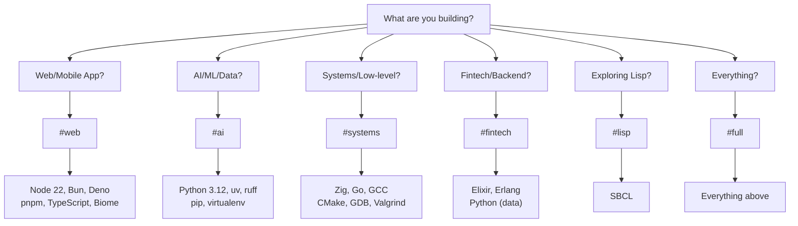
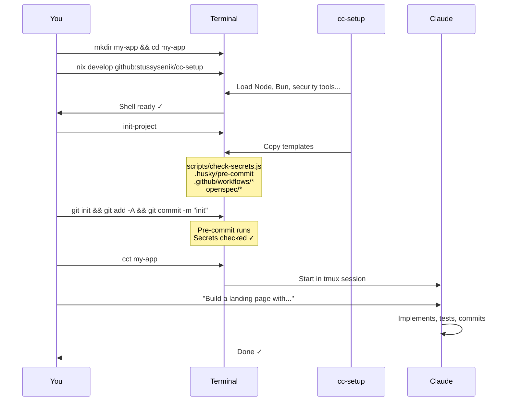
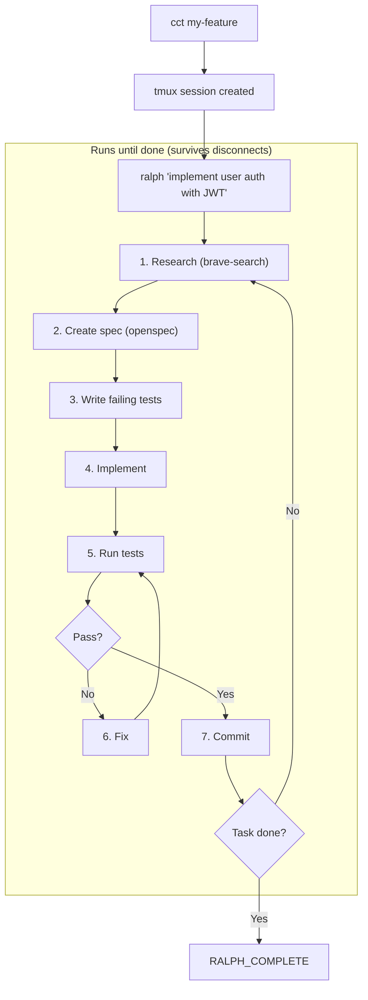

# cc-setup

Your swiss army knife for starting any project. One command, full environment, security baked in.

```
nix develop github:stussysenik/cc-setup#web
```

## The Problem This Solves

```
BEFORE cc-setup                      AFTER cc-setup
─────────────────────────────────    ─────────────────────────────────
"Which node version?"                One command → everything works
"Where's my .env?"                   Security scans on every commit
"Did I commit an API key?"           Templates for CI/CD ready
"How do I set up pre-commit?"        Same setup across all machines
"What was that bash alias again?"    Identical environment everywhere
```

## Quick Start

```bash
# 1. Install Nix (one-time, 2 min)
curl --proto '=https' --tlsv1.2 -sSf -L https://install.determinate.systems/nix | sh -s -- install

# 2. Restart terminal, then start a project
mkdir my-new-app && cd my-new-app
nix develop github:stussysenik/cc-setup#web

# 3. Initialize with all templates
init-project

# 4. Start coding with Claude
cct my-new-app
```

---

## Choose Your Shell



### Shell Reference

| Building... | Use | Command |
|:------------|:----|:--------|
| React/Next.js/Svelte app | `#web` | `nix develop .#web` |
| REST API with Express/Bun | `#web` | `nix develop .#web` |
| Mobile app with Capacitor | `#web` | `nix develop .#web` |
| ML model / data pipeline | `#ai` | `nix develop .#ai` |
| Python backend (FastAPI) | `#ai` | `nix develop .#ai` |
| CLI tool in Go/Zig | `#systems` | `nix develop .#systems` |
| Game engine / embedded | `#systems` | `nix develop .#systems` |
| Trading system | `#fintech` | `nix develop .#fintech` |
| Distributed backend | `#fintech` | `nix develop .#fintech` |
| Learning Lisp | `#lisp` | `nix develop .#lisp` |
| Full-stack polyglot | `#full` | `nix develop .#full` |

---

## What's Always Included (Core)

Every shell includes these essentials:

```
╔═══════════════════════════════════════════════════════════════════════╗
║  CORE (in every shell)                                                ║
╠═══════════════════════════════════════════════════════════════════════╣
║                                                                       ║
║  🤖 CLAUDE                                                            ║
║     cc             Start Claude                                       ║
║     ralph "task"   Autonomous mode (runs until done)                  ║
║     cct [name]     Claude in tmux (survives disconnects)              ║
║                                                                       ║
║  🔒 SECURITY (baked in, not optional)                                 ║
║     check-secrets  Scan for leaked API keys                           ║
║     scan-vulns     Run vulnerability scanner (trivy)                  ║
║     audit          Full security audit                                ║
║     gitleaks       Pre-installed for CI/CD                            ║
║                                                                       ║
║  📋 PROJECT SETUP                                                     ║
║     init-project   Copy all templates (CI, hooks, openspec)           ║
║     init-husky     Just pre-commit hooks                              ║
║     init-openspec  Just spec-driven development                       ║
║                                                                       ║
║  🛠️  INFRASTRUCTURE                                                    ║
║     supabase       Database CLI                                       ║
║     vercel         Deployment CLI                                     ║
║     gh             GitHub CLI                                         ║
║                                                                       ║
║  ⚡ DX TOOLS                                                          ║
║     bat            cat with syntax highlighting                       ║
║     eza            ls with icons and git status                       ║
║     fd             find but intuitive                                 ║
║     rg             grep but 10x faster                                ║
║     fzf            Ctrl+R fuzzy history, Ctrl+T fuzzy files           ║
║     zoxide         z command (smart cd that learns)                   ║
║     lazygit        Git TUI                                            ║
║     delta          Pretty git diffs                                   ║
║     just           Language-agnostic task runner                      ║
║     watchexec      Run command on file changes                        ║
║                                                                       ║
║  🌐 BROWSER AUTOMATION (MCPs)                                         ║
║     chrome-devtools   Browser automation, performance                 ║
║     brave-search      Web research                                    ║
║     playwright        E2E testing                                     ║
║                                                                       ║
╚═══════════════════════════════════════════════════════════════════════╝
```

---

## The Workflow

### Starting a New Project



### Autonomous Development (Ralph)



**Why tmux?** You can disconnect (close laptop, SSH drops) and Claude keeps running. Reconnect later with the same `cct my-feature` command.

---

## Templates Included

When you run `init-project`, these are copied to your project:

```
your-project/
├── scripts/
│   ├── check-secrets.js           # Block commits with API keys
│   └── autonomous/
│       └── ralph-loop.sh          # Run Claude overnight
├── .husky/
│   └── pre-commit                 # Security + lint on commit
├── .github/
│   └── workflows/
│       ├── ci.yml                 # Lint, test, security on push
│       └── security.yml           # Daily vulnerability scans
├── openspec/
│   ├── AGENTS.md                  # Spec-driven dev instructions
│   └── project.md                 # Project conventions
├── .claude-ops/
│   └── config.sh                  # Auto-approve MCP domains
├── vercel.json                    # Security headers (web only)
└── .gitignore                     # Comprehensive ignore list
```

---

## Security Philosophy

```
┌─────────────────────────────────────────────────────────────────────┐
│  Security is NOT optional. It's baked into the core.                │
│                                                                     │
│  EVERY commit → Pre-commit hook checks for secrets                  │
│  EVERY push   → CI scans with gitleaks + trivy                      │
│  EVERY day    → Scheduled security scan (if GitHub Actions)         │
│                                                                     │
│  You don't have to think about it. It just happens.                 │
└─────────────────────────────────────────────────────────────────────┘
```

**What gets blocked:**
- API keys (OpenAI, Anthropic, Stripe, AWS, etc.)
- JWT tokens
- Database credentials
- Private keys
- Any string matching common secret patterns

---

## Commands Reference

```
╔═══════════════════════════════════════════════════════════════════════╗
║  CLAUDE                                                               ║
╠═══════════════════╤═══════════════════════════════════════════════════╣
║  cc               │ Start Claude                                      ║
║  ralph "task"     │ Autonomous mode (skips permission prompts)        ║
║  cct [name]       │ Claude in tmux session (persistent)               ║
╠═══════════════════╧═══════════════════════════════════════════════════╣
║  PROJECT SETUP                                                        ║
╠═══════════════════╤═══════════════════════════════════════════════════╣
║  init-project     │ Copy all templates to current directory           ║
║  init-husky       │ Just pre-commit hooks                             ║
║  init-openspec    │ Just spec-driven development                      ║
╠═══════════════════╧═══════════════════════════════════════════════════╣
║  SECURITY                                                             ║
╠═══════════════════╤═══════════════════════════════════════════════════╣
║  check-secrets    │ Scan for leaked API keys                          ║
║  scan-vulns       │ Run trivy vulnerability scanner                   ║
║  audit            │ Full audit (secrets + vulns + deps)               ║
╠═══════════════════╧═══════════════════════════════════════════════════╣
║  NAVIGATION                                                           ║
╠═══════════════════╤═══════════════════════════════════════════════════╣
║  z <dir>          │ Smart cd (learns your frequent directories)       ║
║  Ctrl+R           │ Fuzzy search command history                      ║
║  Ctrl+T           │ Fuzzy find files                                  ║
╠═══════════════════╧═══════════════════════════════════════════════════╣
║  UTILITIES                                                            ║
╠═══════════════════╤═══════════════════════════════════════════════════╣
║  watch <cmd>      │ Re-run command on file changes                    ║
║  serve [port]     │ Quick HTTP server (default 8000)                  ║
║  lazygit          │ Git TUI                                           ║
╚═══════════════════╧═══════════════════════════════════════════════════╝
```

---

## Per-Project Auto-Loading (direnv)

Don't want to type `nix develop` every time?

```bash
# In your project directory
echo 'use flake github:stussysenik/cc-setup#web' > .envrc
direnv allow

# Now it auto-loads when you cd into the project
cd ~/projects/my-app   # → Environment loads automatically
```

---

## Alacritty (Optional)

Alacritty is a fast GPU-accelerated terminal. Install it globally:

```bash
nix profile install nixpkgs#alacritty
```

Then use it like any terminal. The cc-setup shell runs *inside* Alacritty.

---

## How Nix Works (Mental Model)

```
┌─────────────────────────────────────────────────────────────────────┐
│  nix develop github:stussysenik/cc-setup#web                        │
└─────────────────────────────────────────────────────────────────────┘
                            │
                            ▼
┌─────────────────────────────────────────────────────────────────────┐
│  1. Fetch flake.nix from GitHub (cached after first time)           │
│  2. Read flake.lock → exact package versions                        │
│  3. Download packages to /nix/store/                                │
│  4. Enter shell with all tools in PATH                              │
│  5. Run shellHook (symlinks, aliases, functions)                    │
└─────────────────────────────────────────────────────────────────────┘

First run: ~2-5 minutes (downloads everything)
After that: ~1 second (cached)
```

---

## Updating

```bash
# Add a new tool to your setup
cd ~/Desktop/cc-setup
vim flake.nix   # Add package to the list
git add . && git commit -m "Add X" && git push

# On any machine, get updates
nix flake update
nix develop github:stussysenik/cc-setup#web
```

---

## FAQ

**Q: First run is slow?**
A: Yes, Nix downloads and caches everything. After that it's instant.

**Q: How to add a language?**
A: Edit `flake.nix`, add to the relevant `*Pkgs` list:
```nix
systemsPkgs = with pkgs; [
  zig
  go
  gfortran   # ← add this
];
```

**Q: Works on macOS?**
A: Yes! Same flake works on Linux and macOS.

**Q: How to clean up disk space?**
A: `nix-collect-garbage -d` removes unused packages.

**Q: Can I use this without Claude?**
A: Yes, all the tools work standalone. Claude is optional.

---

## Architecture

```
cc-setup/
├── flake.nix                # Package definitions + shell hooks
├── flake.lock               # Pinned versions
│
├── config/
│   ├── claude/
│   │   ├── settings.json    # MCP server configs
│   │   └── CLAUDE.md        # Global Claude instructions
│   └── claude-ops/
│       └── config.sh        # Auto-approve domains
│
├── templates/               # Copied by init-project
│   ├── scripts/
│   │   ├── check-secrets.js
│   │   └── autonomous/
│   │       └── ralph-loop.sh
│   ├── husky/pre-commit
│   ├── github/workflows/
│   │   ├── ci.yml
│   │   └── security.yml
│   ├── openspec/
│   └── vercel.json
│
└── scripts/
    ├── init-project.sh
    ├── init-husky.sh
    └── ralph.sh
```
