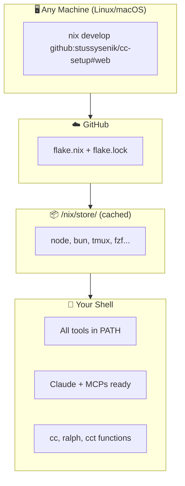
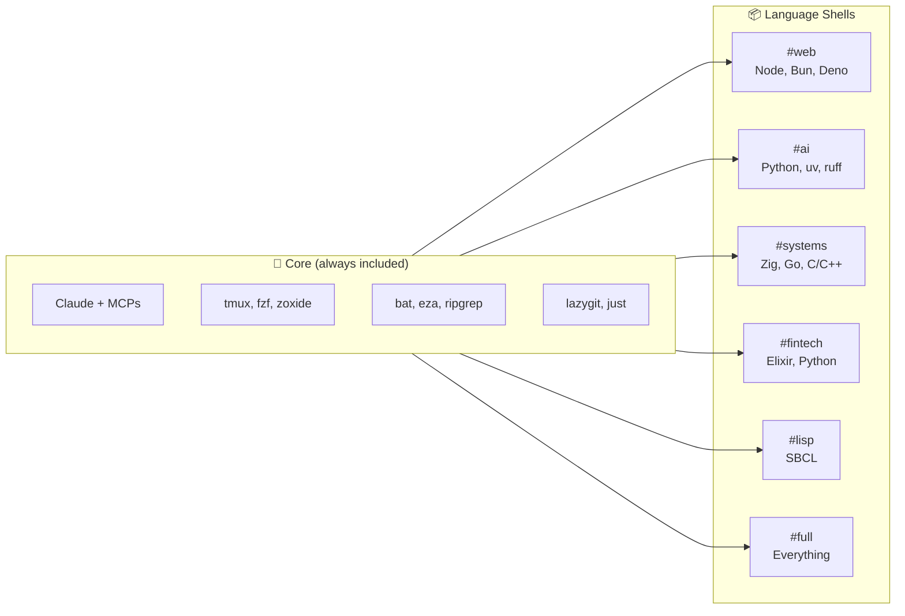
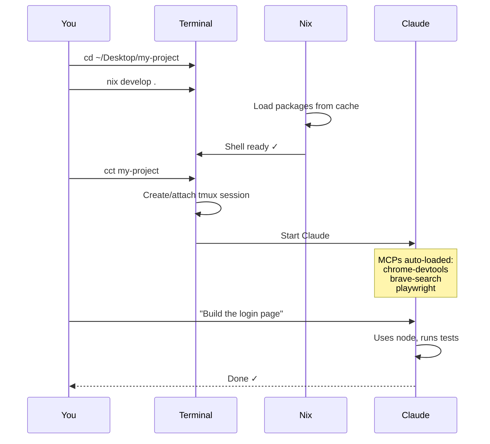
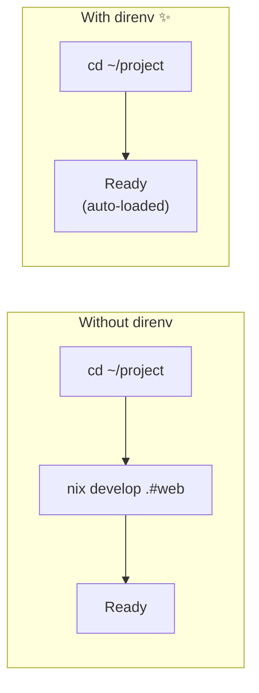
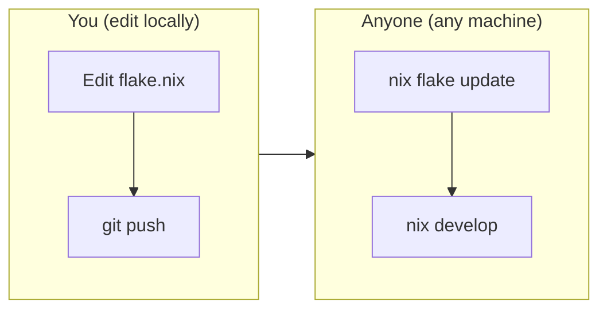
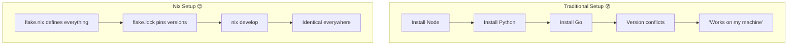

# cc-setup

Portable Claude Code environment with language-specific shells.

```
┌────────────────────────────────────────────────────────────────┐
│  ONE COMMAND. ANY MACHINE. IDENTICAL ENVIRONMENT.              │
│                                                                │
│  nix develop github:stussysenik/cc-setup#web                   │
└────────────────────────────────────────────────────────────────┘
```

## Quick Start

```bash
# 1. Install Nix (one-time, 2 minutes)
curl --proto '=https' --tlsv1.2 -sSf -L \
  https://install.determinate.systems/nix | sh -s -- install

# 2. Restart terminal, then:
nix develop github:stussysenik/cc-setup#web
```

## How It Works



## Available Shells



| Shell | Command | What You Get |
|:------|:--------|:-------------|
| `default` | `nix develop` | Core only |
| `web` | `nix develop .#web` | Node 22, Bun, Deno, pnpm, Biome |
| `ai` | `nix develop .#ai` | Python 3.12, uv, ruff |
| `systems` | `nix develop .#systems` | Zig, Go, GCC, CMake, GDB |
| `fintech` | `nix develop .#fintech` | Elixir, Erlang, Python |
| `lisp` | `nix develop .#lisp` | SBCL |
| `full` | `nix develop .#full` | All languages |

## Architecture

```
┌─────────────────────────────────────────────────────────────────────┐
│ TERMINAL (Alacritty / iTerm / Konsole / any)                        │
│ ┌─────────────────────────────────────────────────────────────────┐ │
│ │ TMUX SESSION (survives disconnects, named per-project)          │ │
│ │ ┌─────────────────────────────────────────────────────────────┐ │ │
│ │ │ NIX SHELL (isolated, reproducible)                          │ │ │
│ │ │                                                             │ │ │
│ │ │  ┌─────────────┐  ┌─────────────┐  ┌─────────────────────┐  │ │ │
│ │ │  │ Languages   │  │ DX Tools    │  │ Claude + MCPs       │  │ │ │
│ │ │  │             │  │             │  │                     │  │ │ │
│ │ │  │ • node      │  │ • fzf       │  │ • cc (start)        │  │ │ │
│ │ │  │ • python    │  │ • zoxide    │  │ • ralph (auto)      │  │ │ │
│ │ │  │ • zig       │  │ • bat       │  │ • cct (tmux)        │  │ │ │
│ │ │  │ • go        │  │ • lazygit   │  │                     │  │ │ │
│ │ │  │ • ...       │  │ • ...       │  │ MCPs:               │  │ │ │
│ │ │  │             │  │             │  │ • chrome-devtools   │  │ │ │
│ │ │  │             │  │             │  │ • brave-search      │  │ │ │
│ │ │  │             │  │             │  │ • playwright        │  │ │ │
│ │ │  └─────────────┘  └─────────────┘  └─────────────────────┘  │ │ │
│ │ │                                                             │ │ │
│ │ └─────────────────────────────────────────────────────────────┘ │ │
│ └─────────────────────────────────────────────────────────────────┘ │
└─────────────────────────────────────────────────────────────────────┘
```

## Workflow Example



## Commands Reference

```
╔═══════════════════════════════════════════════════════════════════╗
║ CLAUDE                                                            ║
╠═══════════════╤═══════════════════════════════════════════════════╣
║ cc            │ Start Claude                                      ║
║ ralph "task"  │ Autonomous mode (runs until RALPH_COMPLETE)       ║
║ cct [name]    │ Claude in tmux session (persistent)               ║
╠═══════════════╧═══════════════════════════════════════════════════╣
║ NAVIGATION                                                        ║
╠═══════════════╤═══════════════════════════════════════════════════╣
║ z <dir>       │ Smart cd (learns your frequent directories)       ║
║ Ctrl+R        │ Fuzzy search command history                      ║
║ Ctrl+T        │ Fuzzy find files                                  ║
╠═══════════════╧═══════════════════════════════════════════════════╣
║ WORKFLOW                                                          ║
╠═══════════════╤═══════════════════════════════════════════════════╣
║ watch <cmd>   │ Re-run command on file changes                    ║
║ serve [port]  │ Quick HTTP server (default: 8000)                 ║
║ lazygit       │ Git TUI                                           ║
╠═══════════════╧═══════════════════════════════════════════════════╣
║ IMPROVED CLI (aliased automatically)                              ║
╠═══════════════╤═══════════════════════════════════════════════════╣
║ cat           │ → bat (syntax highlighting)                       ║
║ ls            │ → eza (icons, colors)                             ║
║ find          │ → fd (faster, intuitive)                          ║
║ grep          │ → rg (ripgrep, 10x faster)                        ║
║ diff          │ → delta (pretty diffs)                            ║
╚═══════════════╧═══════════════════════════════════════════════════╝
```

## Per-Project Auto-Loading



**Setup:**

```bash
# 1. Create .envrc in your project
echo 'use flake github:stussysenik/cc-setup#web' > ~/Desktop/my-project/.envrc

# 2. Allow it (one-time per project)
cd ~/Desktop/my-project
direnv allow

# 3. Now it auto-loads every time you cd into the project
```

## Updating



```bash
# Add a new tool
cd ~/Desktop/cc-setup
vim flake.nix  # add your package
git add . && git commit -m "Add X" && git push

# Get updates on any machine
nix flake update
nix develop github:stussysenik/cc-setup#web
```

## File Structure

```
cc-setup/
├── flake.nix                 # Package definitions + shell hooks
├── flake.lock                # Pinned versions (reproducibility)
├── config/
│   └── claude/
│       ├── settings.json     # MCP server configs
│       └── CLAUDE.md         # Global Claude instructions
├── scripts/
│   ├── init-husky.sh         # Pre-commit setup helper
│   └── ralph.sh              # Standalone autonomous launcher
└── README.md
```

## FAQ

```
┌─────────────────────────────────────────────────────────────────────┐
│ Q: First run is slow?                                               │
├─────────────────────────────────────────────────────────────────────┤
│ A: Yes. Nix downloads and caches everything once.                   │
│    Subsequent runs are instant (< 1 second).                        │
└─────────────────────────────────────────────────────────────────────┘

┌─────────────────────────────────────────────────────────────────────┐
│ Q: What about Alacritty?                                            │
├─────────────────────────────────────────────────────────────────────┤
│ A: It's just a fast terminal. Install separately:                   │
│    nix profile install nixpkgs#alacritty                            │
│    Then use it like any terminal.                                   │
└─────────────────────────────────────────────────────────────────────┘

┌─────────────────────────────────────────────────────────────────────┐
│ Q: How to add a language?                                           │
├─────────────────────────────────────────────────────────────────────┤
│ A: Edit flake.nix, add to the relevant *Pkgs list:                  │
│                                                                     │
│    systemsPkgs = with pkgs; [                                       │
│      zig                                                            │
│      go                                                             │
│      gfortran    # ← add this                                       │
│    ];                                                               │
└─────────────────────────────────────────────────────────────────────┘

┌─────────────────────────────────────────────────────────────────────┐
│ Q: Works on macOS?                                                  │
├─────────────────────────────────────────────────────────────────────┤
│ A: Yes! Nix works on both Linux and macOS.                          │
│    Same flake, same tools, same experience.                         │
└─────────────────────────────────────────────────────────────────────┘

┌─────────────────────────────────────────────────────────────────────┐
│ Q: How to remove everything?                                        │
├─────────────────────────────────────────────────────────────────────┤
│ A: nix-collect-garbage -d                                           │
│    This removes all unused packages from /nix/store                 │
└─────────────────────────────────────────────────────────────────────┘
```

## Mental Model



```
Traditional:                         Nix:
─────────────────────────────────    ─────────────────────────────────
$ node --version                     $ nix develop .#web
v18.0.0  (varies by machine)         $ node --version
                                     v22.0.0  (same everywhere, always)

$ pip install numpy                  $ nix develop .#ai
ERROR: conflicts with...             $ python -c "import numpy"
                                     (just works, isolated)
```
