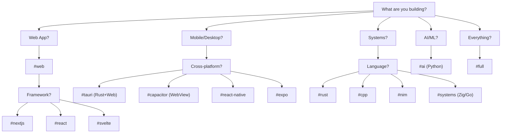
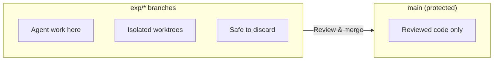

# cc-setup

Your swiss army knife for starting any project. One command, full environment, security baked in.

```
nix develop github:stussysenik/cc-setup#web
```

## The Problem This Solves

```
BEFORE cc-setup                      AFTER cc-setup
─────────────────────────────────    ─────────────────────────────────
"Which node version?"                One command → everything works
"Where's my .env?"                   Security scans on every commit
"Did I commit an API key?"           Templates for CI/CD ready
"How do I set up pre-commit?"        Same setup across all machines
"What was that bash alias again?"    Identical environment everywhere
```

## Quick Start

```bash
# 1. Install Nix (one-time, 2 min)
curl --proto '=https' --tlsv1.2 -sSf -L https://install.determinate.systems/nix | sh -s -- install

# 2. Restart terminal, then start a project
mkdir my-new-app && cd my-new-app
nix develop github:stussysenik/cc-setup#web

# 3. Initialize with all templates
init-project

# 4. Start coding with Claude (safe mode - creates experimental branch)
cct my-feature
```

---

## Branch Safety (Read This First)

When using autonomous AI agents, **always use the safe commands**:

```bash
ralph my-feature    # Creates exp/YYYYMMDD-my-feature branch, then runs Claude
cct my-feature      # Same, but in tmux (survives disconnects)
```

Safe mode creates an **experimental branch + worktree** so:
- Main branch stays clean
- You can review AI's changes before merging
- Easy to discard if you don't like the results: `wt-rm ../worktrees/...`

**Dangerous mode** (use only when you know what you're doing):
```bash
ralph-yolo          # Runs on current branch - no safety net
cct-yolo            # Same, in tmux
```

---

## Choose Your Shell



### Shell Reference

| Building... | Use | Command |
|:------------|:----|:--------|
| React/Next.js/Svelte app | `#web` | `nix develop .#web` |
| REST API with Express/Bun | `#web` | `nix develop .#web` |
| ML model / data pipeline | `#ai` | `nix develop .#ai` |
| Python backend (FastAPI) | `#ai` | `nix develop .#ai` |
| Rust CLI / library | `#rust` | `nix develop .#rust` |
| C/C++ project | `#cpp` | `nix develop .#cpp` |
| Nim application | `#nim` | `nix develop .#nim` |
| CLI tool in Go/Zig | `#systems` | `nix develop .#systems` |
| Game engine / embedded | `#systems` | `nix develop .#systems` |
| Trading system | `#fintech` | `nix develop .#fintech` |
| Distributed backend | `#fintech` | `nix develop .#fintech` |
| Learning Lisp | `#lisp` | `nix develop .#lisp` |
| Full-stack polyglot | `#full` | `nix develop .#full` |

### Framework-Specific Shells

| Framework | Shell | What You Get |
|:----------|:------|:-------------|
| Next.js | `#nextjs` | App Router, `cna` alias, ESLint |
| React + Vite | `#react` | `cra` alias (Vite template), ESLint |
| Svelte/SvelteKit | `#svelte` | `sk` alias, svelte-add |
| Tailwind CSS | `#tailwind` | `tw-init`, Prettier |
| Storybook | `#storybook` | Component dev, `sb` alias |
| Phoenix (Elixir) | `#phoenix` | Mix, Hex, PostgreSQL, inotify |
| API Development | `#api` | OpenAPI generator, Redocly CLI |

### Cross-Platform / Mobile Shells

| Target | Shell | Stack |
|:-------|:------|:------|
| Desktop (native) | `#tauri` | Rust + Web → Windows/Mac/Linux |
| Mobile (WebView) | `#capacitor` | Web + Capacitor → iOS/Android |
| Mobile (native) | `#react-native` | React → native iOS/Android |
| Mobile (managed) | `#expo` | Expo → iOS/Android (easier) |
| iOS only | `#ios` | CocoaPods, Fastlane, xcpretty |

### Systems Language Shells

| Language | Shell | What You Get |
|:---------|:------|:-------------|
| Rust | `#rust` | cargo, clippy, rust-analyzer, cargo-watch |
| C/C++ | `#cpp` | clang, cmake, ninja, gdb, valgrind |
| Nim | `#nim` | nim, nimble, nimlsp |
| Assembly | `#asm` | nasm, gdb, objdump |

### Graphics / WebAssembly Shells

| Domain | Shell | What You Get |
|:-------|:------|:-------------|
| OpenGL/Vulkan | `#graphics` | glfw, glew, mesa, vulkan, shaderc |
| WebAssembly | `#wasm` | wasm-pack, emscripten, wasmtime, binaryen |

### Editor Shells

| Editor | Shell | What You Get |
|:-------|:------|:-------------|
| Neovim | `#nvim` | neovim, LSP servers, LazyVim-ready |
| Emacs | `#emacs` | emacs29, Org mode, sqlite, pandoc |

### Optional Heavy Shells

These shells include large tools. Only use when needed.

| Shell | Size | What You Get |
|:------|:-----|:-------------|
| `#re` | ~2GB | Ghidra, Radare2, binwalk, hexyl |
| `#full` | ~4GB | Everything (all languages + tools) |

---

## What's Always Included (Core)

Every shell includes these essentials:

```
╔═══════════════════════════════════════════════════════════════════════╗
║  CORE (in every shell)                                                ║
╠═══════════════════════════════════════════════════════════════════════╣
║                                                                       ║
║  🤖 CLAUDE                                                            ║
║     cc             Start Claude                                       ║
║     ralph "task"   Autonomous mode (runs until done)                  ║
║     cct [name]     Claude in tmux (survives disconnects)              ║
║                                                                       ║
║  🔒 SECURITY (baked in, not optional)                                 ║
║     check-secrets  Scan for leaked API keys                           ║
║     scan-vulns     Run vulnerability scanner (trivy)                  ║
║     audit          Full security audit                                ║
║     gitleaks       Pre-installed for CI/CD                            ║
║                                                                       ║
║  📋 PROJECT SETUP                                                     ║
║     init-project   Copy all templates (CI, hooks, openspec)           ║
║     init-husky     Just pre-commit hooks                              ║
║     init-openspec  Just spec-driven development                       ║
║                                                                       ║
║  🛠️  INFRASTRUCTURE                                                    ║
║     supabase       Database CLI                                       ║
║     vercel         Deployment CLI                                     ║
║     gh             GitHub CLI                                         ║
║                                                                       ║
║  ⚡ DX TOOLS                                                          ║
║     bat            cat with syntax highlighting                       ║
║     eza            ls with icons and git status                       ║
║     fd             find but intuitive                                 ║
║     rg             grep but 10x faster                                ║
║     fzf            Ctrl+R fuzzy history, Ctrl+T fuzzy files           ║
║     zoxide         z command (smart cd that learns)                   ║
║     lazygit        Git TUI                                            ║
║     delta          Pretty git diffs                                   ║
║     just           Language-agnostic task runner                      ║
║     watchexec      Run command on file changes                        ║
║                                                                       ║
║  🌐 BROWSER AUTOMATION (MCPs)                                         ║
║     chrome-devtools   Browser automation, performance                 ║
║     brave-search      Web research                                    ║
║     playwright        E2E testing                                     ║
║                                                                       ║
║  📊 OBSERVABILITY                                                     ║
║     hyperfine         Benchmark any command                           ║
║     btm               Process monitor (bottom)                        ║
║     httpstat          curl with timing breakdown                      ║
║     oha               HTTP load testing                               ║
║     tokei             Lines of code stats                             ║
║     dog               DNS lookup with timing                          ║
║                                                                       ║
║  📚 STACKED DIFFS (git-branchless)                                    ║
║     stack-init        Enable stacked diffs in repo                    ║
║     sl                Smartlog - visual commit graph                  ║
║     prev / next       Navigate commit stack                           ║
║     restack           Rebase stack after changes                      ║
║     submit            Create PRs for stack                            ║
║     absorb            Auto-fixup staged changes                       ║
║                                                                       ║
║  🔌 API DEVELOPMENT                                                   ║
║     xh                HTTP client (like curl but pretty)              ║
║     hurl              Run HTTP requests from files                    ║
║     posting           TUI API client (like Postman)                   ║
║     curlie            curl with httpie syntax                         ║
║                                                                       ║
║  🗄️  DATABASE CLIs                                                     ║
║     pgcli             PostgreSQL with autocomplete                    ║
║     litecli           SQLite with autocomplete                        ║
║     usql              Universal SQL (postgres, mysql, sqlite, etc)    ║
║                                                                       ║
╚═══════════════════════════════════════════════════════════════════════╝
```

---

## The Workflow

### Starting a New Project


### Autonomous Development (Ralph)


**Why tmux?** You can disconnect (close laptop, SSH drops) and Claude keeps running. Reconnect later with the same `cct my-feature` command.

---

## Branch Safety (Experimental Isolation)

When running autonomous agents, **always work on experimental branches** to prevent slop from hitting your main codebase.



### Safe Mode Commands

| Command | What It Does |
|:--------|:-------------|
| `exp <name>` | Create experimental branch + worktree |
| `ralph <name>` | Auto-create exp branch, then run autonomous |
| `cct <name>` | Tmux + exp branch + autonomous |
| `wt-list` | List all worktrees |
| `wt-rm <path>` | Remove a worktree |
| `wt-prune` | Clean up stale worktrees |

### Example Workflow

```bash
# Start autonomous work safely
cct auth-feature

# Claude works in exp/20250114-auth-feature branch
# When done, review changes in isolated worktree
cd ../worktrees/20250114-auth-feature
git diff main

# If good, merge. If not, just delete the worktree
wt-rm ../worktrees/20250114-auth-feature
```

---

## Stacked Diffs

Modern Git workflow using `git-branchless`. Instead of long-lived branches, work in small, reviewable commits that stack on each other.

```
┌─────────────────────────────────────────────────────────────────────┐
│  Traditional              vs.       Stacked Diffs                   │
│  ───────────────────────────────────────────────────────────────── │
│  feature-branch (100s of lines)     commit 1: Add model (20 lines) │
│         ↓                                ↓                          │
│  One massive PR                     commit 2: Add API (30 lines)   │
│         ↓                                ↓                          │
│  Review nightmare                   commit 3: Add UI (40 lines)    │
│                                          ↓                          │
│                                     3 small, focused PRs            │
└─────────────────────────────────────────────────────────────────────┘
```

### Quick Start

```bash
# Enable in your repo (once)
stack-init

# View your commit graph
sl

# Navigate through commits
prev    # go to parent commit
next    # go to child commit

# After rebasing parent, fix children
restack

# Undo any git operation
undo

# Create PRs for your stack
submit
```

---

## Templates Included

When you run `init-project`, these are copied to your project:

```
your-project/
├── scripts/
│   ├── check-secrets.js           # Block commits with API keys
│   └── autonomous/
│       └── ralph-loop.sh          # Run Claude overnight
├── .husky/
│   └── pre-commit                 # Security + lint on commit
├── .github/
│   └── workflows/
│       ├── ci.yml                 # Lint, test, security on push
│       └── security.yml           # Daily vulnerability scans
├── openspec/
│   ├── AGENTS.md                  # Spec-driven dev instructions
│   └── project.md                 # Project conventions
├── .claude-ops/
│   └── config.sh                  # Auto-approve MCP domains
├── vercel.json                    # Security headers (web only)
└── .gitignore                     # Comprehensive ignore list
```

---

## Security Philosophy

```
┌─────────────────────────────────────────────────────────────────────┐
│  Security is NOT optional. It's baked into the core.                │
│                                                                     │
│  EVERY commit → Pre-commit hook checks for secrets                  │
│  EVERY push   → CI scans with gitleaks + trivy                      │
│  EVERY day    → Scheduled security scan (if GitHub Actions)         │
│                                                                     │
│  You don't have to think about it. It just happens.                 │
└─────────────────────────────────────────────────────────────────────┘
```

**What gets blocked:**
- API keys (OpenAI, Anthropic, Stripe, AWS, etc.)
- JWT tokens
- Database credentials
- Private keys
- Any string matching common secret patterns

---

## Commands Reference

```
╔═══════════════════════════════════════════════════════════════════════╗
║  CLAUDE                                                               ║
╠═══════════════════╤═══════════════════════════════════════════════════╣
║  cc               │ Start Claude                                      ║
║  ralph <task>     │ Safe autonomous (creates exp branch)              ║
║  ralph-yolo       │ Dangerous autonomous (current branch)             ║
║  cct <task>       │ Safe Claude in tmux (creates exp branch)          ║
║  cct-yolo         │ Dangerous Claude in tmux (current branch)         ║
╠═══════════════════╧═══════════════════════════════════════════════════╣
║  BRANCH SAFETY                                                        ║
╠═══════════════════╤═══════════════════════════════════════════════════╣
║  exp <name>       │ Create experimental branch + worktree             ║
║  wt-list          │ List all worktrees                                ║
║  wt-rm <path>     │ Remove a worktree                                 ║
║  wt-prune         │ Clean stale worktrees                             ║
╠═══════════════════╧═══════════════════════════════════════════════════╣
║  STACKED DIFFS                                                        ║
╠═══════════════════╤═══════════════════════════════════════════════════╣
║  stack-init       │ Enable git-branchless in repo                     ║
║  sl               │ Smartlog (visual commit graph)                    ║
║  prev / next      │ Navigate commit stack                             ║
║  restack          │ Rebase stack after parent changes                 ║
║  submit           │ Create PRs for your stack                         ║
║  absorb           │ Auto-fixup staged changes to right commits        ║
║  undo             │ Undo last git operation                           ║
╠═══════════════════╧═══════════════════════════════════════════════════╣
║  PROJECT SETUP                                                        ║
╠═══════════════════╤═══════════════════════════════════════════════════╣
║  init-project     │ Copy all templates to current directory           ║
║  init-husky       │ Just pre-commit hooks                             ║
║  init-openspec    │ Just spec-driven development                      ║
╠═══════════════════╧═══════════════════════════════════════════════════╣
║  SECURITY                                                             ║
╠═══════════════════╤═══════════════════════════════════════════════════╣
║  check-secrets    │ Scan for leaked API keys                          ║
║  scan-vulns       │ Run trivy vulnerability scanner                   ║
║  audit            │ Full audit (secrets + vulns + deps)               ║
╠═══════════════════╧═══════════════════════════════════════════════════╣
║  NAVIGATION                                                           ║
╠═══════════════════╤═══════════════════════════════════════════════════╣
║  z <dir>          │ Smart cd (learns your frequent directories)       ║
║  Ctrl+R           │ Fuzzy search command history                      ║
║  Ctrl+T           │ Fuzzy find files                                  ║
╠═══════════════════╧═══════════════════════════════════════════════════╣
║  OBSERVABILITY                                                        ║
╠═══════════════════╤═══════════════════════════════════════════════════╣
║  hyperfine <cmd>  │ Benchmark command with stats                      ║
║  btm              │ Process monitor (like htop but better)            ║
║  httpstat <url>   │ curl with timing breakdown                        ║
║  oha <url>        │ HTTP load testing                                 ║
║  tokei            │ Count lines of code by language                   ║
║  dog <domain>     │ DNS lookup with timing                            ║
╠═══════════════════╧═══════════════════════════════════════════════════╣
║  API DEVELOPMENT                                                      ║
╠═══════════════════╤═══════════════════════════════════════════════════╣
║  xh <url>         │ HTTP client (pretty curl)                         ║
║  hurl <file>      │ Run HTTP requests from .hurl files                ║
║  posting          │ TUI API client (like Postman)                     ║
║  pgcli            │ PostgreSQL with autocomplete                      ║
║  usql             │ Universal SQL client                              ║
╠═══════════════════╧═══════════════════════════════════════════════════╣
║  STORYBOOK (#storybook shell)                                         ║
╠═══════════════════╤═══════════════════════════════════════════════════╣
║  sb-init          │ Initialize Storybook in project                   ║
║  sb               │ Run Storybook dev server                          ║
║  sb-build         │ Build static Storybook                            ║
║  chromatic        │ Visual testing with Chromatic                     ║
╠═══════════════════╧═══════════════════════════════════════════════════╣
║  RUST (#rust shell)                                                   ║
╠═══════════════════╤═══════════════════════════════════════════════════╣
║  cw               │ cargo watch -x check                              ║
║  ct               │ cargo nextest run (tests)                         ║
║  cb               │ cargo build --release                             ║
╠═══════════════════╧═══════════════════════════════════════════════════╣
║  C/C++ (#cpp shell)                                                   ║
╠═══════════════════╤═══════════════════════════════════════════════════╣
║  cm               │ cmake -B build -G Ninja                           ║
║  cmb              │ cmake --build build                               ║
║  cmt              │ ctest --test-dir build                            ║
╠═══════════════════╧═══════════════════════════════════════════════════╣
║  CROSS-PLATFORM                                                       ║
╠═══════════════════╤═══════════════════════════════════════════════════╣
║  tauri-init       │ Create new Tauri app                              ║
║  tauri-dev        │ Run Tauri in dev mode                             ║
║  cap-init         │ Initialize Capacitor                              ║
║  cap-sync         │ Sync web code to native                           ║
║  rn-start         │ Start React Native Metro                          ║
║  expo-start       │ Start Expo dev server                             ║
╠═══════════════════╧═══════════════════════════════════════════════════╣
║  REVERSE ENGINEERING (#re shell, optional)                            ║
╠═══════════════════╤═══════════════════════════════════════════════════╣
║  ghidra           │ Launch Ghidra GUI                                 ║
║  r2 <file>        │ Radare2 analysis                                  ║
║  binwalk <file>   │ Firmware extraction                               ║
║  hex <file>       │ Pretty hex viewer                                 ║
╠═══════════════════╧═══════════════════════════════════════════════════╣
║  UTILITIES                                                            ║
╠═══════════════════╤═══════════════════════════════════════════════════╣
║  watch <cmd>      │ Re-run command on file changes                    ║
║  serve [port]     │ Quick HTTP server (default 8000)                  ║
║  lazygit          │ Git TUI                                           ║
╚═══════════════════╧═══════════════════════════════════════════════════╝
```

---

## Per-Project Auto-Loading (direnv)

Don't want to type `nix develop` every time?

```bash
# In your project directory
echo 'use flake github:stussysenik/cc-setup#web' > .envrc
direnv allow

# Now it auto-loads when you cd into the project
cd ~/projects/my-app   # → Environment loads automatically
```

---

## Alacritty (Optional)

Alacritty is a fast GPU-accelerated terminal. Install it globally:

```bash
nix profile install nixpkgs#alacritty
```

Then use it like any terminal. The cc-setup shell runs *inside* Alacritty.

---

## How Nix Works (Mental Model)

```
┌─────────────────────────────────────────────────────────────────────┐
│  nix develop github:stussysenik/cc-setup#web                        │
└─────────────────────────────────────────────────────────────────────┘
                            │
                            ▼
┌─────────────────────────────────────────────────────────────────────┐
│  1. Fetch flake.nix from GitHub (cached after first time)           │
│  2. Read flake.lock → exact package versions                        │
│  3. Download packages to /nix/store/                                │
│  4. Enter shell with all tools in PATH                              │
│  5. Run shellHook (symlinks, aliases, functions)                    │
└─────────────────────────────────────────────────────────────────────┘

First run: ~2-5 minutes (downloads everything)
After that: ~1 second (cached)
```

---

## Updating

```bash
# Add a new tool to your setup
cd ~/Desktop/cc-setup
vim flake.nix   # Add package to the list
git add . && git commit -m "Add X" && git push

# On any machine, get updates
nix flake update
nix develop github:stussysenik/cc-setup#web
```

---

## FAQ

**Q: First run is slow?**
A: Yes, Nix downloads and caches everything. After that it's instant.

**Q: How to add a language?**
A: Edit `flake.nix`, add to the relevant `*Pkgs` list:
```nix
systemsPkgs = with pkgs; [
  zig
  go
  gfortran   # ← add this
];
```

**Q: Works on macOS?**
A: Yes! Same flake works on Linux and macOS.

**Q: How to clean up disk space?**
A: `nix-collect-garbage -d` removes unused packages.

**Q: Can I use this without Claude?**
A: Yes, all the tools work standalone. Claude is optional.

**Q: What's the design philosophy?**
A: Minimal by default, single responsibility, easy reversal. See [PHILOSOPHY.md](./PHILOSOPHY.md).

---

## Architecture

```
cc-setup/
├── flake.nix                # Package definitions + shell hooks
├── flake.lock               # Pinned versions
│
├── config/
│   ├── claude/
│   │   ├── settings.json    # MCP server configs
│   │   └── CLAUDE.md        # Global Claude instructions
│   └── claude-ops/
│       └── config.sh        # Auto-approve domains
│
├── templates/               # Copied by init-project
│   ├── scripts/
│   │   ├── check-secrets.js
│   │   └── autonomous/
│   │       └── ralph-loop.sh
│   ├── husky/pre-commit
│   ├── github/workflows/
│   │   ├── ci.yml
│   │   └── security.yml
│   ├── openspec/
│   └── vercel.json
│
└── scripts/
    ├── init-project.sh
    ├── init-husky.sh
    └── ralph.sh
```
